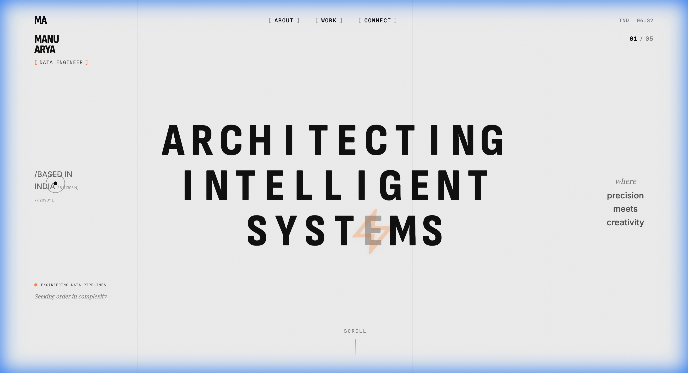

# Manu Arya | Portfolio Website



A modern, high-performance portfolio website featuring smooth animations, responsive design, and stunning visual effects.

---

## ✨ Features

- **Animated Preloader** - Odometer-style percentage counter with rotating text
- **Custom Cursor** - Interactive dot with expanding circle on hover
- **Smooth Scrolling** - Powered by Lenis for buttery-smooth scroll
- **Scroll Animations** - GSAP + ScrollTrigger for section reveals
- **Responsive Design** - Optimized for desktop, tablet, and mobile
- **Dark/Light Transitions** - Sections with dynamic theme changes
- **Magnetic Elements** - Interactive buttons and links
- **Accordion Projects** - Expandable project cards

---

## 🛠 Tech Stack

| Technology | Purpose |
|------------|---------|
| HTML5 | Structure |
| CSS3 | Styling & Animations |
| JavaScript | Interactivity |
| [GSAP](https://greensock.com/gsap/) | Animation library |
| [ScrollTrigger](https://greensock.com/scrolltrigger/) | Scroll-based animations |
| [Lenis](https://lenis.studiofreight.com/) | Smooth scrolling |

---

## 🚀 Quick Start

### Run Locally
```bash
# Clone the repository
git clone https://github.com/manuarya1610/Portfolio-Website.git

# Open in browser
open index.html
```

### Deploy
This is a static website. Deploy to any of these platforms:
- [Netlify](https://netlify.com)
- [Vercel](https://vercel.com)
- [GitHub Pages](https://pages.github.com)

---

## 📁 Project Structure

```
Portfolio-Website/
├── index.html          # Main HTML file
├── styles.css          # All styles and animations
├── animations.js       # GSAP animations and interactions
├── assets/
│   ├── preview.png     # Website preview
│   └── about-illustration.png
└── README.md
```

---

## 📱 Responsive Breakpoints

| Device | Width |
|--------|-------|
| Large Desktop | 1440px+ |
| Desktop | 1200px |
| Tablet | 768px |
| Mobile | 480px |
| Small Mobile | 320px |

---

## 🎨 Design Credits

- **Fonts**: Inter, Sofia Sans Condensed, Playfair Display, JetBrains Mono
- **Design Inspiration**: Modern portfolio aesthetics
- **Illustrations**: Custom created

---

## 📄 License

MIT License - feel free to use for your own portfolio!

---

Made with ❤️ by [Manu Arya](https://github.com/manuarya1610)